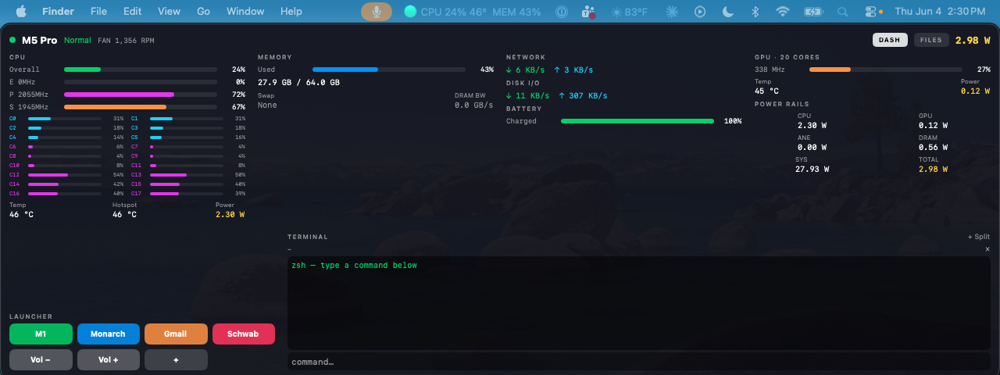

# Touch Up D — v3.0

**Turn any touchscreen monitor into a real touch control deck for your Mac.**



*A 12.3" Prechen strip display running as a touch deck: live system stats, one-tap
app launchers, volume controls, and a terminal — every element finger-tappable,
while the mouse cursor stays exactly where you left it on your main display.*

## What it feels like

- **Tap a button, it activates.** No cursor hunting, no dragging windows around —
  the touchscreen behaves like an appliance, not like a second mouse pad.
- **Your pointer never leaves your work.** The cursor blips to the touch for the
  ~100 ms of the tap and snaps back to its exact position the moment you lift.
- **Drags and holds just work** — your finger is the cursor only while it's on the glass.
- **Invisible.** No dock icon, no menu bar item, no app to launch. A launchd daemon
  that survives reboots and starts before you log in.

## Why this needs to exist

Tap-to-click for touchscreen monitors on macOS, done at the layer below WindowServer.

macOS has no native touchscreen support: it treats USB touch digitizers as absolute
pointing devices and moves the cursor on whatever display it's on — there is no
built-in way to bind touch to the touchscreen itself. User-space drivers can't fix
this on modern macOS because WindowServer keeps its own event connection to the
device even when an app "seizes" it.

**Touch Up D** is a root launchd daemon that:

1. **Seizes the touch device exclusively** (root + Input Monitoring) — macOS stops
   receiving its events entirely; the cursor no longer jumps when you touch.
2. **Parses the raw HID reports** (absolute X/Y + tip switch).
3. **Maps touches to the display you bind** and posts clicks there.
4. **Restores the cursor** to its pre-touch position on finger lift — your pointer
   never visibly leaves the screen you're working on.

## Install (guided)

```bash
sudo bash install.sh
```

macOS requires *you* to grant two permissions — no installer can do it for you.
So the installer walks you through it: it opens **[SETUP.md](SETUP.md)** plus each
System Settings window by name — first **"Input Monitoring"**, then
**"Accessibility"** — tells you exactly what to click in each, and auto-detects
the moment each grant lands (`✓ Input Monitoring granted — device seized`,
`✓ Accessibility granted — clicks enabled`). The daemon also registers itself
with TCC, so `touchupd` appears in both lists without hunting for it by path.

| Window | Permission | Why |
|---|---|---|
| "Input Monitoring" | exclusive (seized) access to the touch device | stops macOS moving the cursor on touch |
| "Accessibility" | posting synthetic clicks | makes taps actually click |

Non-interactive install (CI, scripted): `sudo NO_GUIDE=1 bash install.sh`.

## Configure

Flags (add to `ProgramArguments` in `/Library/LaunchDaemons/de.modularequity.touchupd.plist`):

| Flag | Purpose |
|---|---|
| `--vid 0x222a` / `--pid 0x335` | your touchscreen's USB vendor/product ID (`hidutil list` to find) |
| `--display 1280x480` | logical resolution of the display to bind (System Settings → Displays) |
| `--swap-xy`, `--invert-x`, `--invert-y` | axis calibration |
| `--no-restore-cursor` | leave the cursor where you tapped instead of snapping back |
| `-v` | verbose logging to `/var/log/touchupd.log` |

## Uninstall

```bash
sudo bash uninstall.sh
```

## Tested on

- Prechen 12.3" touchscreen (Techwin/ILITEK controller, VID `0x222a` PID `0x335`)
- macOS 26, Apple Silicon

## Credits

Inspired by and developed alongside [Touch-Up](https://github.com/shueber/Touch-Up)
by Sebastian Hueber (MIT). This project takes the seize-based approach his
TouchUpCore framework sketched and moves it into a root daemon where it actually
severs WindowServer's event delivery.

MIT License — see LICENSE.
